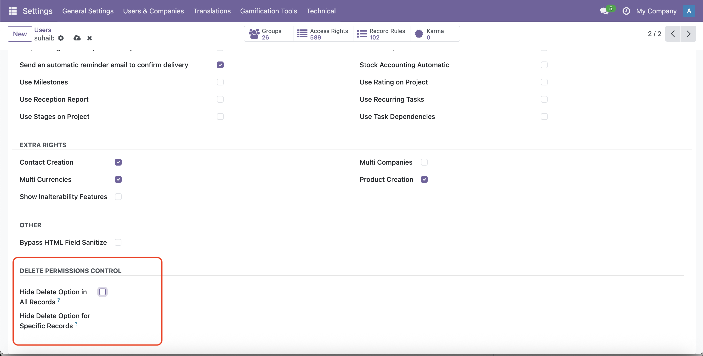
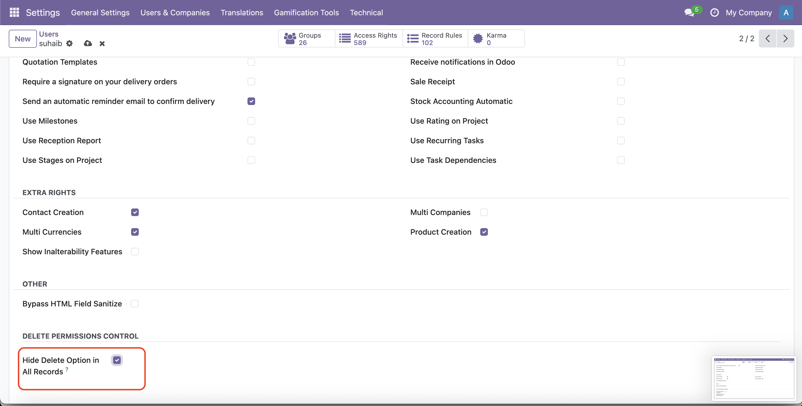
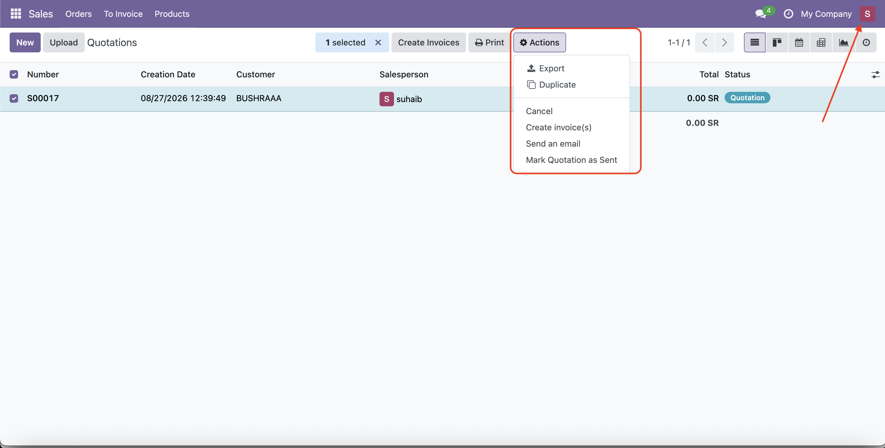
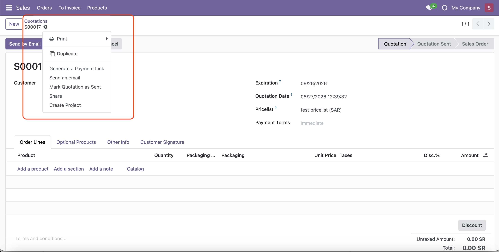

# User Delete Control

Odoo 18 module that gives administrators control over record deletion permissions on a per-user basis.

## Overview

**User Delete Control** helps administrators prevent users from deleting records that they are not allowed to remove.

The module provides both **backend protection** and **user interface protection**, helping reduce accidental or unauthorized record deletion.

## Features

* 🔒 Disable record deletion for a specific user across the system.
* 🎯 Restrict deletion for specific record types/models.
* 🛡️ Backend protection through `unlink()`.
* 🖥️ Hide the Delete action from List and Form views.
* 👤 Configure deletion restrictions directly from the user form.
* ⚙️ Supports Odoo 18.

## Configuration

After installing the module:

1. Go to **Settings → Users & Companies → Users**.
2. Open the user you want to configure.
3. Navigate to the **Access Rights** section.
4. Find **Delete Permissions Control**.
5. Enable **Hide Delete Option in All Records** to prevent the user from deleting any record.
6. Alternatively, select specific models under **Hide Delete Option for Specific Records**.

## How It Works

The module provides two levels of protection:

### User Interface Protection

The Delete action is hidden from List and Form views when deletion is restricted for the current user.

### Backend Protection

The module also protects the `unlink()` operation at the backend level.

This means that hiding the Delete button is not the only security mechanism. Unauthorized deletion attempts through backend operations are also blocked.

## Example

A user can be configured to:

| Configuration                     | Result                                                           |
| --------------------------------- | ---------------------------------------------------------------- |
| Hide Delete Option in All Records | User cannot delete any record                                    |
| Restrict Contacts only            | User cannot delete Contacts but can delete other allowed records |
| Restrict Products and Contacts    | User cannot delete Products or Contacts                          |
| No restrictions                   | Normal Odoo deletion behavior                                    |

## Screenshots

### Delete Permissions Control

Configure deletion permissions directly from the user's Access Rights.

$

### Restricted Delete Action

When deletion is restricted, the Delete action is hidden from the user interface.

## Installation

1. Download or clone the module.
2. Place the `user_delete_control` directory inside your Odoo custom addons directory.
3. Restart the Odoo server.
4. Update the Apps list.
5. Install **User Delete Control**.

## Requirements

* Odoo 18.0
* Odoo Enterprise or Community
* Python 3

## Technical Information

**Module:** `user_delete_control`

**Version:** `18.0.1.0.0`

**License:** LGPL-3

**Dependencies:**

* `base`
* `web`

## Support

For questions, bug reports, or feature requests, please use the GitHub repository issue tracker.

## Author

**Bushra Alamarnah**

GitHub: https://github.com/bushraamarnah/odoo-delete-permissions-control

